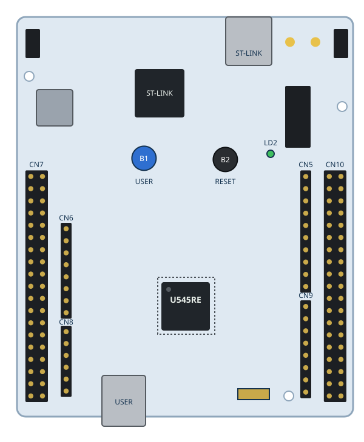

# NUCLEO-U545RE-Q Example (STM32U545RET6Q)



The 64-pin STM32U5 Nucleo board (MB1841) in LabWired. A derivative of the
[NUCLEO-U575ZI-Q](../nucleo-u575zi/README.md) target: same U5 IP family, 512 KiB
flash, 256 KiB + 16 KiB SRAM, one user LED.

Console: **USART1** PA9 (TX) / PA10 (RX) @ 115200 8N1 (ST-LINK VCP).
LED: **LD2** green on **PA5** (active high). Button: **B1** on **PC13** (active high).

> Tier: **sim-validated**. SVD-derived, no bench part. See
> [`VALIDATION.md`](VALIDATION.md) for exact commands, evidence and what was NOT
> validated (Zephyr), and
> [`../../docs/boards/nucleo-u545re.md`](../../docs/boards/nucleo-u545re.md) for the
> board page.

## Quick start (repo root)

```bash
# 1. bare-metal blinky smoke (committed ELF, no toolchain needed)
cargo run -q -p labwired-cli -- test --script examples/nucleo-u545re/io-smoke.yaml

# 2. machine-run pin proofs (LD2 PA5, B1 PC13, VCP, memory map, flash banks)
cargo test -p labwired-core --test nucleo_u545re

# 3. STM32CubeU5 HAL firmware (needs arm-none-eabi-gcc + a CubeU5 checkout)
make -C examples/nucleo-u545re/board_firmware
cargo run -q -p labwired-cli -- \
  --firmware examples/nucleo-u545re/board_firmware/build/u545_hal_smoke.elf \
  --system examples/nucleo-u545re/system.yaml --max-steps 20000000
# -> U545-HAL OK / BLINK 0 LD2=1 B1=0
```

## Files

- `system.yaml` - example system manifest (chip + LD2 + B1)
- `io-smoke.yaml` - CLI test script (`strict_onboarding` needs this name)
- `firmware/` - bare-metal blinky source; builds `tests/fixtures/nucleo-u545re-blinky.elf`
- `board_firmware/` - Cube HAL smoke; its ELF is committed as `tests/fixtures/nucleo-u545re-cubehal.elf`
- `images/` - `board.svg`, `pinout.svg`, `gen_images.py` (see its header for provenance)
- `REQUIRED_DOCS.md`, `EXTERNAL_COMPONENTS.md`, `VALIDATION.md`

## References

- Chip: [`configs/chips/stm32u545.yaml`](../../configs/chips/stm32u545.yaml)
- Board system: [`configs/systems/nucleo-u545re.yaml`](../../configs/systems/nucleo-u545re.yaml)
